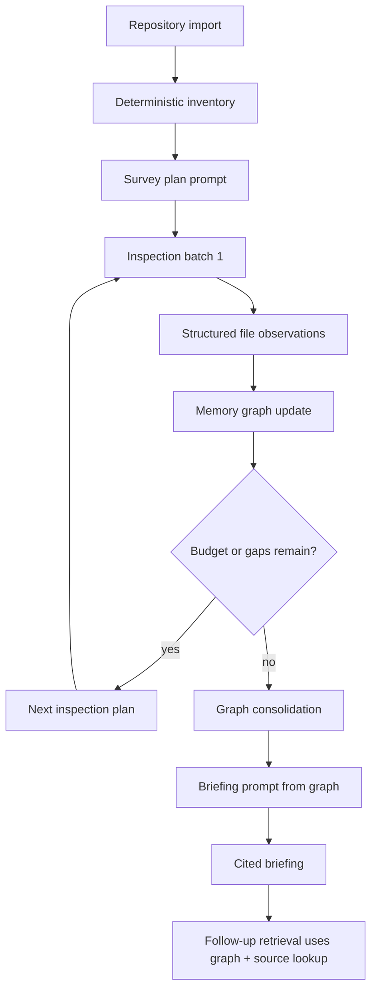

# Iterative Repository Survey and Memory Graph Plan

## Summary

Replace Sonar's initial briefing path with a bounded, map-first repository survey that uses the local model to inspect selected evidence, write structured observations, and synthesize a briefing from an explicit memory graph. Retrieval remains useful for follow-up questions and source lookup, but it stops being the primary mechanism for creating the first overview.

---

## Problem Frame

The current initial briefing path still carries the shape of retrieval-augmented question answering: parse files into units, rank candidate chunks, pass selected chunks to a model, and ask for a coherent briefing. That works better for targeted questions than for project orientation. A repository overview needs an organized model of the system before writing begins.

The new approach treats a codebase as incomplete and potentially misleading evidence. Filenames, variable names, framework conventions, and README content are weak signals. The system should build a structured, source-backed memory of observed responsibilities, boundaries, workflows, inputs, outputs, state, risks, and uncertainty before asking the model to write the final briefing.

---

## Requirements

- R1. Initial briefing generation must use a repository survey and memory graph as the primary synthesis input, not top-k vector or lexical retrieval results.
- R2. The survey must work across generic codebases, including sparse docs, misleading names, non-web projects, and repositories without package manifests, framework roots, or schema files.
- R3. Every graph node and edge produced by the LLM must carry source evidence and confidence; unsupported observations must be rejected or marked as uncertainty.
- R4. The survey must be bounded by fixed iteration, file-count, token, and time budgets so local models remain practical on a laptop.
- R5. The system must preserve deterministic safeguards: file inventory, noise filtering, language detection, size limits, and fallback sampling cannot depend on the LLM.
- R6. The final briefing must be generated from the memory graph plus compact source excerpts, with citations tied back to repository files.
- R7. Follow-up questions must use the memory graph for orientation context and existing retrieval for targeted source lookup.
- R8. The UI must show survey progress in human terms: inventory, survey plan, file inspection, graph synthesis, and briefing generation.
- R9. The implementation must keep vector search optional and dormant for initial briefings unless explicitly enabled for follow-up retrieval.
- R10. The test suite must include messy generic fixtures: sparse docs, misleading names, non-TypeScript source, and a repo where important behavior is found through inputs/outputs rather than names.

---

## Key Technical Decisions

- KTD1. Map-first initial briefing: The first briefing starts from a repository survey plan and memory graph. Retrieval no longer selects the core briefing context by asking which chunks match "overview."
- KTD2. Deterministic inventory before model calls: Sonar enumerates files, languages, sizes, dependency edges, parsed symbols, likely entry points, strings, IO hints, and external-boundary hints before asking the LLM what to inspect.
- KTD3. LLM as analyst, not search engine: The model chooses inspection priorities and writes structured observations. It does not freely crawl the filesystem, and it does not decide which source text exists.
- KTD4. Explicit graph memory: Survey memory is stored as typed nodes and edges, not embeddings. Graph records are small, auditable, source-backed, and suitable for final briefing prompts.
- KTD5. Weak-signal scoring: Names and paths remain hints, but behavior signals such as reads, writes, network calls, CLI args, event handlers, tests, config keys, and imports receive first-class treatment.
- KTD6. Bounded iterative loop: The survey runs in a fixed number of passes. Each pass selects a diverse batch of files, extracts observations, updates the graph, and records unresolved gaps.
- KTD7. Confidence-first output: The final briefing includes what appears likely, what is strongly evidenced, what is weakly evidenced, and what a human should ask next.
- KTD8. Current retrieval remains for follow-ups: Existing BM25, local grep, exact search, graph expansion, and optional vector search continue to answer targeted questions after the briefing exists.
- KTD9. JSON schema without heavy new dependencies: Start with TypeScript validators and strict JSON repair prompts. Add a schema dependency only if validation code becomes error-prone.

---

## High-Level Technical Design

The deterministic inventory owns filesystem truth. The LLM receives compact inventory views and selected source excerpts. It returns structured observations that are validated before they enter the graph. The final generator writes from graph memory first and source excerpts second.

---

## Memory Graph Shape

The graph should support these node families:

- `repository`: inferred project type, scope, primary languages, confidence, and missing context.
- `area`: major responsibility area, independent of directory names.
- `workflow`: user, operator, system, or batch journey.
- `boundary`: input, output, external service, file system, network, process, device, database, queue, or UI boundary.
- `state`: persisted or in-memory data being transformed.
- `risk`: uncertainty, operational concern, security/privacy concern, or missing evidence.
- `file`: source evidence anchor with compact file summary and observed responsibilities.

Edges should stay intentionally small:

- `supports`: file or area supports a workflow.
- `reads`: component reads state or input.
- `writes`: component writes state or output.
- `calls`: source evidence shows one area invokes another.
- `depends_on`: area or workflow depends on boundary or external system.
- `unclear_about`: graph node has an unresolved gap.

Every node and edge must include source references using repo-relative file paths and line ranges where available.

---

## Implementation Units

### U1. Repository Inventory and Generic Signal Extraction

- **Goal:** Build a deterministic inventory that is useful even when names, docs, and framework conventions are poor.
- **Files:**
  - `src/survey/repository-inventory.ts`
  - `src/survey/source-signals.ts`
  - `src/parser/file-walker.ts`
  - `src/parser/language-support.ts`
  - `src/parser/types.ts`
  - `test/repository-inventory.test.ts`
- **Patterns to follow:** Keep parser output repo-relative like `CodeUnit.filePath`. Reuse vendored and unsupported-language logic from `src/parser/file-walker.ts` and `src/parser/language-support.ts`.
- **Test scenarios:**
  - A C fixture with no README still reports language counts, likely entry files, IO hints, and large-file/noise exclusions.
  - A repo with misleading filenames still surfaces source signals from function calls, imports, string literals, file operations, and network calls.
  - Unsupported languages appear in inventory warnings without blocking survey creation.
  - Vendored, generated, binary, and lockfile paths are excluded from survey candidates.
- **Verification:** Unit tests assert stable inventory ordering, repo-relative paths, and no dependency on package manifests.

### U2. Memory Graph Types, Validation, and Persistence

- **Goal:** Add an explicit source-backed graph representation for repository understanding.
- **Files:**
  - `src/survey/memory-graph.ts`
  - `src/survey/memory-graph-validator.ts`
  - `src/db/schema.ts`
  - `src/db/project-repo.ts`
  - `test/memory-graph.test.ts`
  - `test/project-repo.test.ts`
- **Patterns to follow:** Follow the current SQLite migration style in `src/db/schema.ts` and JSON parsing tolerance in `src/db/project-repo.ts`.
- **Test scenarios:**
  - Invalid graph JSON is rejected before persistence.
  - Graph nodes without evidence are rejected unless they are explicit uncertainty nodes.
  - Re-indexing a project replaces the old graph with the new graph.
  - Corrupt persisted graph JSON does not crash project loading; it returns an empty or degraded graph with a warning.
- **Verification:** Tests cover schema migration, read/write roundtrip, replacement on re-index, and validation failure paths.

### U3. LLM Survey Prompts and Structured Output Repair

- **Goal:** Create local-model-friendly prompts for survey planning, file observation, graph consolidation, and JSON repair.
- **Files:**
  - `src/generator/repository-survey-prompt.ts`
  - `src/generator/structured-llm.ts`
  - `src/generator/llm-client.ts`
  - `test/repository-survey-prompt.test.ts`
  - `test/structured-llm.test.ts`
- **Patterns to follow:** Use the existing OpenAI-compatible client in `src/generator/llm-client.ts`; keep retries bounded like `generateCompletionWithLengthRetry`.
- **Test scenarios:**
  - Survey planning prompt asks for diverse inspection targets and uncertainty, not final conclusions.
  - File observation prompt requires responsibilities, inputs, outputs, state, boundaries, confidence, and evidence.
  - Repair rejects unsupported claims instead of inventing evidence.
  - Truncated or non-JSON responses produce a controlled fallback rather than breaking the briefing flow.
- **Verification:** Prompt tests assert required sections and safety rules; structured output tests cover malformed JSON, missing evidence, and repair fallback.

### U4. Bounded Iterative Survey Engine

- **Goal:** Run the survey loop: inventory, initial inspection plan, file batch inspection, graph update, gap selection, consolidation.
- **Files:**
  - `src/survey/iterative-survey.ts`
  - `src/survey/file-selection.ts`
  - `src/survey/survey-budget.ts`
  - `src/generator/onboarding.ts`
  - `test/iterative-survey.test.ts`
  - `test/file-selection.test.ts`
- **Patterns to follow:** Follow cancellation behavior from `src/api/project-indexer.ts` and token budgeting from `src/context/token-budget.ts`.
- **Test scenarios:**
  - Survey stops at configured iteration, file, token, and time budgets.
  - File selection remains diverse across directories and languages.
  - If the LLM selects poor files, deterministic fallback adds representative files from high-signal inventory areas.
  - Cancellation stops between model calls and does not persist partial graph as complete.
  - A sparse-doc fixture produces uncertainty nodes rather than generic filler.
- **Verification:** Tests use fake LLM responses so survey behavior is deterministic and fast.

### U5. Graph-First Briefing Generation

- **Goal:** Generate initial briefings from the consolidated memory graph and compact evidence excerpts.
- **Files:**
  - `src/generator/onboarding.ts`
  - `src/generator/onboarding-prompt.ts`
  - `src/generator/citation-verifier.ts`
  - `src/generator/source-fallback.ts`
  - `test/onboarding-generation.test.ts`
  - `test/onboarding-prompt.test.ts`
- **Patterns to follow:** Preserve citation verification and truncation cleanup already used in `src/generator/onboarding.ts`.
- **Test scenarios:**
  - Final briefing prompt receives graph nodes before raw source excerpts.
  - Briefing includes confidence and missing-context language when graph confidence is low.
  - Citation verifier accepts graph-backed source citations and rejects unsupported graph-only claims.
  - If survey graph generation fails, Sonar falls back to the current deterministic evidence planner with a clear warning.
- **Verification:** Existing onboarding prompt tests are updated; new tests assert graph-first prompt structure and fallback behavior.

### U6. API Integration and Progress Reporting

- **Goal:** Wire the survey engine into onboarding routes and expose progress states to the desktop app.
- **Files:**
  - `src/api/onboarding-routes.ts`
  - `src/api/project-indexer.ts`
  - `src/api/api-state.ts`
  - `src-ui/src/App.tsx`
  - `src-ui/src/components/ProgressPanel.tsx`
  - `src-ui/src/types.ts`
  - `test/api.integration.ts`
- **Patterns to follow:** Reuse the existing active-task and cancellation flow in `src-ui/src/App.tsx`.
- **Test scenarios:**
  - API returns successful briefing responses with survey timing and graph metadata.
  - Cancelling during survey inspection stops subsequent model calls.
  - UI progress shows inventory, survey plan, inspecting files, building map, and writing briefing.
  - Stored sessions can still be opened without rerunning survey.
- **Verification:** API integration tests use mocked LLM responses and assert progress-compatible response metadata.

### U7. Follow-Up Retrieval With Graph Orientation

- **Goal:** Use the memory graph as orientation context for follow-up answers while preserving exact/BM25/grep retrieval for specific source lookup.
- **Files:**
  - `src/generator/onboarding-followup.ts`
  - `src/retriever/onboarding-followup-retriever.ts`
  - `src/retriever/query-router.ts`
  - `test/onboarding-followup-retriever.test.ts`
  - `test/query-router.test.ts`
- **Patterns to follow:** Keep current follow-up answer persistence behavior and citation verification.
- **Test scenarios:**
  - Broad follow-up questions include memory graph context before source snippets.
  - Specific file/symbol questions still prefer exact and lexical retrieval.
  - Follow-ups cite source files, not graph text alone.
  - If no graph exists for an older session, follow-up behavior falls back to current retrieval.
- **Verification:** Retrieval tests assert graph context use by intent without breaking exact-source routing.

### U8. Evaluation Fixtures and Regression Harness

- **Goal:** Validate that Sonar's briefing quality improves on the failure cases that motivated the architecture change.
- **Files:**
  - `test/fixtures/survey-c-project/`
  - `test/fixtures/survey-misleading-names/`
  - `test/fixtures/survey-sparse-docs/`
  - `test/fixtures/survey-enterprise-service/`
  - `src/eval/retrieval-cli.ts`
  - `src/eval/briefing-eval.ts`
  - `test/briefing-eval.test.ts`
- **Patterns to follow:** Reuse fixture style from `test/fixtures/eval-repo/` and CLI testing style from `test/retrieval-cli.test.ts`.
- **Test scenarios:**
  - C fixture produces an orientation with inputs, outputs, state, and uncertainty.
  - Misleading-name fixture does not over-trust paths or symbols.
  - Sparse-doc fixture produces useful source-backed briefing instead of README-only output.
  - Enterprise-style fixture states missing context and cross-repo assumptions.
- **Verification:** Evaluation outputs check structured graph coverage, not subjective prose quality alone.

### U9. Documentation and Product Boundary Update

- **Goal:** Explain the new map-first architecture and the product boundary honestly.
- **Files:**
  - `README.md`
  - `docs/getting-started.md`
  - `docs/desktop.md`
  - `docs/language-support.md`
  - `docs/SUMMARY.md`
- **Patterns to follow:** Keep public docs light and user-facing; avoid internal comparison or retrospective language.
- **Test scenarios:**
  - Documentation references map-first briefing and local-model suitability.
  - Documentation does not promise deep debugging, refactoring, or exhaustive code analysis.
  - Language-support docs explain that unsupported files may still contribute through inventory-level signals when full parsing is unavailable.
- **Verification:** Documentation review plus stale-language scan for claims that contradict the product boundary.

---

## Scope Boundaries

### In Scope

- Initial briefing generation moves to iterative survey plus memory graph.
- Existing retrieval remains available for follow-up questions.
- SQLite persists graph memory with project/session lifecycle.
- The desktop app reports survey progress and cancellation.
- Evaluation fixtures cover generic, messy, and non-web repositories.

### Deferred

- Autonomous long-running exploration beyond fixed local-model budgets.
- Full semantic understanding for every programming language.
- Multi-repository enterprise knowledge stitching.
- Human-editable graph visualization in the desktop app.
- Cloud-hosted collaborative graph storage.

### Out of Scope

- Turning Sonar into a coding agent, debugger, or refactoring tool.
- Requiring embeddings for initial briefing generation.
- Treating README, paths, framework conventions, or package manifests as authoritative truth.

---

## System-Wide Impact

The change shifts Sonar's center of gravity from retrieval to analysis. Indexing still produces code units and search indexes, but the initial briefing path becomes an analysis pipeline with model calls before final generation. The database grows from project/session storage into project memory storage. The UI progress model must reflect more steps because "briefing generation" now includes iterative inspection.

The main operational impact is model-call count. Local models will run several smaller calls instead of one large final prompt. That should improve local-model reliability, but the plan must keep budgets visible and configurable.

---

## Risks and Mitigations

| Risk | Mitigation |
| --- | --- |
| Local model returns invalid JSON | Strict validators, bounded repair prompt, and deterministic fallback observations. |
| Early survey picks bad files | Diversity rules and deterministic fallback batches from inventory signals. |
| Survey is too slow on laptop | Fixed iteration, file, token, and time budgets; progress UI; cancellation between calls. |
| Graph contains hallucinated claims | Reject nodes and edges without source evidence; require uncertainty nodes for unsupported hypotheses. |
| Briefing becomes too abstract | Final prompt receives representative source excerpts for high-value graph nodes. |
| Existing follow-up retrieval regresses | Keep retrieval path intact and add graph context only as orientation. |
| Schema migration breaks older local data | Add migration tests and tolerant graph parsing in `src/db/project-repo.ts`. |

---

## Acceptance Examples

- AE1. Given a C repository with no README and no package manifest, when Sonar creates a briefing, then the output identifies inputs, outputs, state, boundaries, and uncertainty using source-backed graph evidence.
- AE2. Given a repository with misleading filenames, when the survey graph is built, then graph nodes prioritize observed behavior over path names.
- AE3. Given a repository with sparse docs, when the final briefing is generated, then it does not become README-only and includes source-backed workflows or system areas.
- AE4. Given a local model that returns malformed JSON for one inspection batch, when the survey continues, then Sonar repairs or discards that batch and still produces a degraded but valid briefing.
- AE5. Given a user asks a follow-up like "where does this workflow start?", when a memory graph exists, then Sonar uses graph context to orient the answer and retrieval to cite concrete files.
- AE6. Given a user cancels during inspection, when the current model call finishes or aborts, then no completed briefing session is persisted from partial graph state.

---

## Documentation and Operational Notes

The implementation should keep public documentation focused on user outcomes. The docs should say Sonar builds local-first project briefings from repository evidence. They should not describe the graph as a magic understanding engine. The graph is an internal memory artifact that improves briefing reliability and provides confidence/uncertainty grounding.

For local models, defaults should favor smaller inspection batches and stricter output schemas over large context windows. Configuration can expose broad budget presets later, but the first implementation should keep budgets internal and conservative.

---

## Sources and Existing Code References

- `src/generator/onboarding.ts` currently orchestrates briefing generation and should become the integration point for the survey engine.
- `src/retriever/briefing-evidence-planner.ts` and `src/retriever/briefing-workflow-planner.ts` contain useful deterministic heuristics that can be reused as fallback and inventory signals.
- `src/parser/file-walker.ts`, `src/parser/language-support.ts`, and `src/parser/types.ts` define the current repository parsing and source-unit contract.
- `src/db/schema.ts` and `src/db/project-repo.ts` define the persistence pattern for projects, code units, and onboarding sessions.
- `src/generator/llm-client.ts` is the current OpenAI-compatible model boundary.
- `src-ui/src/App.tsx` and `src-ui/src/components/ProgressPanel.tsx` own desktop progress and cancellation behavior.
